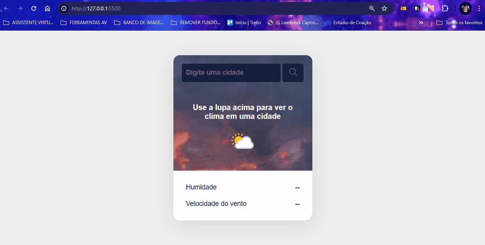

# Projeto App Previsão do tempo

Um projeto de aplicativo para previsão do tempo onde o usuário digita o nome da cidade na busca e clica na lupa para mostrar o nome da cidade , a temperatura, o ícone da condição climática e o nome da condição climática. Logo abaixo mostra a humidade e a velocidade do vento. Para telas de desktops, tablets e celulares 📲💻

## Tecnologias utilizadas
- HTML
- CSS
- JAVASCRIPT

## 📂 Acesso ao projeto

Você pode acessar o código fonte do projeto 

<https://github.com/denisero19/app-previsao-do-tempo>